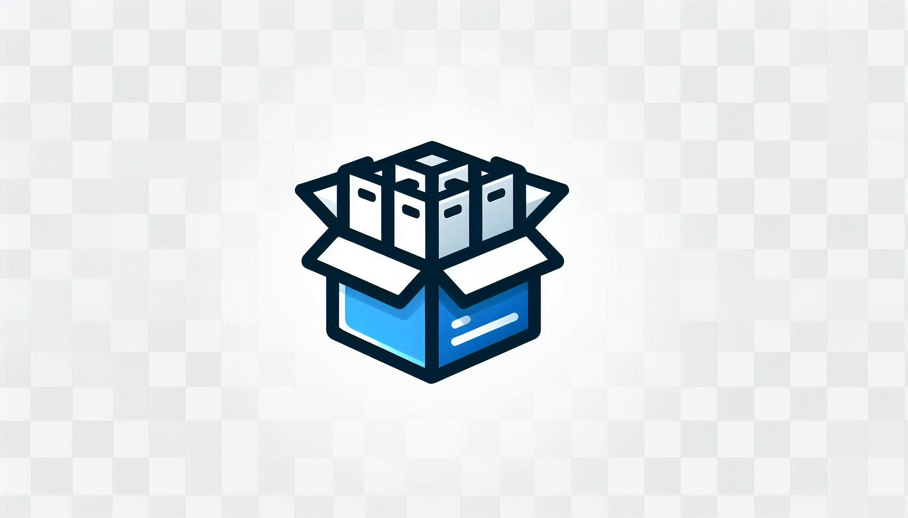
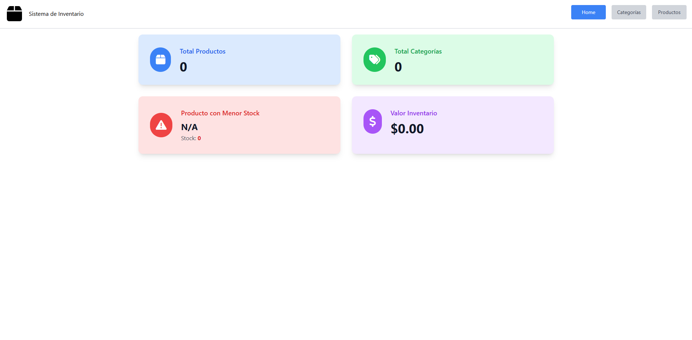
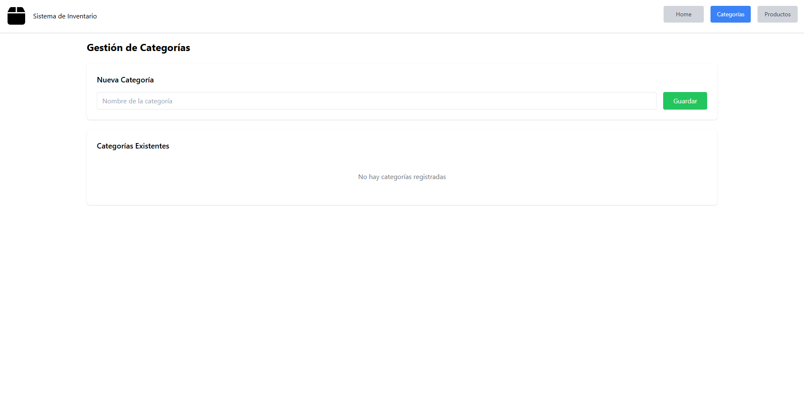
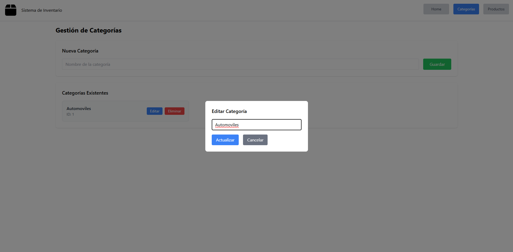
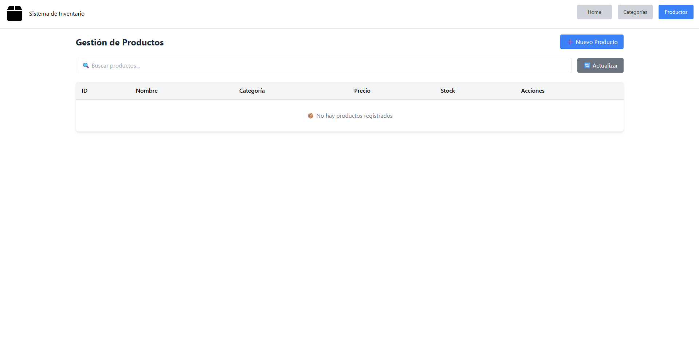
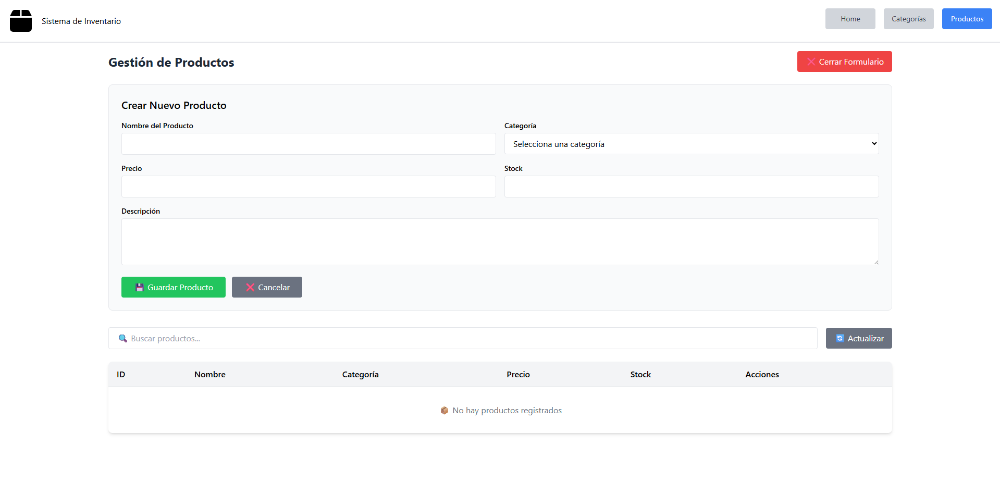

  

<h1 align="center">Sistema de Inventario</h1>

Sistema web desarrollado en Laravel para la gestión integral de inventarios, productos y categorías.

---

## 🚀 Descripción

**Sistema de Inventario** es una aplicación web desarrollada como proyecto personal para demostrar habilidades en desarrollo full stack con Laravel.  
El sistema permite a los administradores gestionar de manera eficiente el inventario de productos, organizándolos por categorías y manteniendo un control detallado del stock disponible.

El proyecto fue realizado con fines de aprendizaje y portafolio, y está pensado para ser presentado en entrevistas o procesos de selección, mostrando tanto la lógica de negocio como la interfaz de usuario y la gestión administrativa.

---

## 🛠️ Características principales

- **Dashboard con métricas en tiempo real:**
  - Total de productos en inventario
  - Total de categorías
  - Productos con stock bajo
  - Valor total del inventario
  - Producto con menor stock

- **Gestión completa de productos:**
  - Crear, editar y eliminar productos
  - Asignar categorías
  - Control de stock y precios
  - Búsqueda y filtrado

- **Gestión de categorías:**
  - Organización jerárquica de productos
  - Crear, editar y eliminar categorías

- **API RESTful:**
  - Endpoints para productos y categorías
  - Autenticación con Laravel Sanctum
  - Respuestas JSON estructuradas

- **Interfaz moderna y responsiva:**
  - Diseño con Tailwind CSS
  - Navegación intuitiva
  - Formularios interactivos

---

##  Tecnologías usadas

- **Laravel 12** (framework backend)
- **PHP 8.2**
- **MySQL/MariaDB** (base de datos, gestionada con XAMPP)
- **Laravel Sanctum** (autenticación API)
- **Tailwind CSS** (estilos)
- **Visual Studio Code** (editor de desarrollo)
- **XAMPP** (servidor local y gestor de base de datos)

---

## 📸 Capturas de pantalla

  

<b>Dashboard:</b> Vista principal con métricas rápidas del inventario, como total de productos, categorías y alertas de stock bajo.

  

<b>Gestión de categorías:</b> Formulario para crear nuevas categorías y listado de categorías disponibles en el sistema.

  

<b>Editar categoría:</b> Interfaz para modificar el nombre de una categoría existente.

  

<b>Gestión de productos:</b> Formulario para crear productos y vista de todos los productos registrados, con detalles clave.

  

<b>Editar producto:</b> Interfaz para actualizar la información de un producto existente, como nombre, categoría, precio o stock.

---